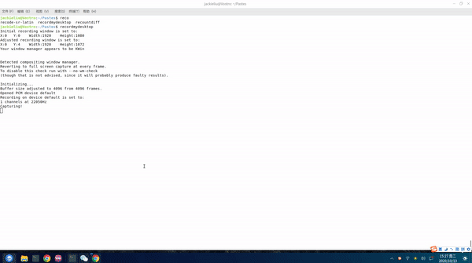

# Pastes

English | [简体中文](./README_cn.md)

 

Thanks for choose pastes.

Pastes is a cross-platform clipboard manager. Open the history panel with `Win+V` on Windows, `Ctrl+Shift+V` on Linux, or the tray icon. While Pastes is running, it handles `Win+V`; exiting restores the native Windows behavior. If the Windows shortcut hook is unavailable, Pastes attempts `Ctrl+Shift+V` and displays the active shortcut in the panel and tray menu.

Pastes can hold the clipboard history within 7 days. You can add it to your system global clipboard by double-clicking or pressing `Enter`. What’s more surprising is that if the focused window can receive clipboard data, Then he will copy the data directly to the focus window.

Use `Tab` / `Shift+Tab` or the left/right arrow keys to cycle through visible cards. Press `Ctrl+F` to focus search, or start typing to search directly. `Tab` from search returns to the selected result.

