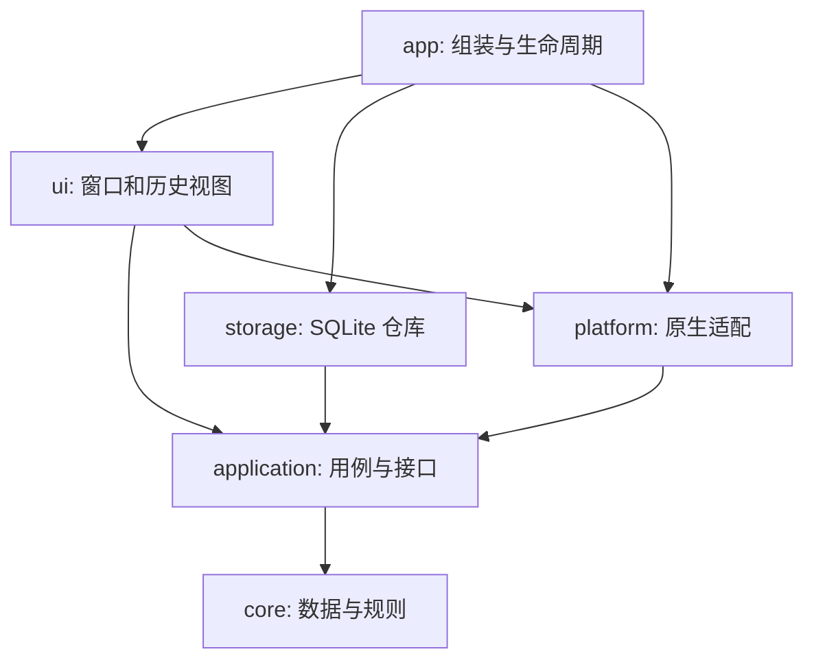

# Pastes 工程架构

Pastes 使用 C++17 和 Qt **6.3 及以上**。架构以剪贴板历史的生命周期划分职责：
数据和规则独立于界面，应用服务组织操作，存储与操作系统提供适配，窗口负责呈现。
每层都有对应的 CMake 目标，应用入口是组装具体实现的唯一位置。

## 目录与构建目标

| 目录 | CMake 目标 | 责任 |
| --- | --- | --- |
| `core/` | `pastes_core` | 条目、MIME 复制、压缩原图、内容指纹、30 天保留规则 |
| `application/` | `pastes_application` | 历史用例、删除与撤销、剪贴板采集与复制、仓库及原生通知接口 |
| `storage/` | `pastes_storage` | SQLite、跨线程值快照、事务、后台图片编码、关闭时排空写入 |
| `platform/` | `pastes_platform` | Windows / macOS / Linux 的剪贴板来源、窗口、菜单、快捷键、粘贴目标和系统设置 |
| `ui/` | `pastes_ui` | 历史视图、卡片、手势、动画、窗口及弹窗 |
| `app/` | `pastes` | 进程入口、单实例、翻译、构造与连接具体实现 |
| `tests/` | 四个测试程序 | 业务、存储、剪贴板和界面交互的回归检查 |
| `cmake/` | 依赖检查 | 检查源码是否越过层级边界 |



箭头表示源码依赖。`HistoryRepository` 和 `ClipboardFeed` 是应用层拥有的接口，
分别由 `Database` 和 `ClipboardSource` 实现。应用服务接收接口引用，不创建 SQLite 连接、
卡片或原生适配器。核心和应用目标只依赖 Qt Core / Gui；SQL 和 Widgets 分别属于外层。

`cmake/check-dependencies.cmake` 检查禁止的 include：核心不能依赖外层，应用不能依赖
界面、存储或平台实现，存储不能引用界面，平台不能引用项目窗口类，界面不能访问 SQL。
这项检查注册为 CTest，新增依赖必须同时满足构建和检查。

## 主要职责

- `HistoryService` 是历史顺序和条目生命周期的唯一管理者。它负责加载、去重、过期清理、
  来源图标更新、图片编码完成匹配及最多 20 次、8 秒窗口内的撤销。它不知道卡片和动画。
- `ClipboardController` 负责原生通知的等待与同步、剪贴板快照、记录暂停与恢复、普通/纯文本复制。
  它通过 `ClipboardFeed` 请求来源图标，通过 `HistoryService` 提交快照。
- `HistoryView` 绑定服务事件，负责卡片呈现、搜索、选择、键盘导航、撤销按钮与动画编排。
  删除命令只传 `EntryId`；复制和预览命令传有明确生命周期的 `HistoryEntry`。
- `CardInteractionController` 只管理按下、浏览、上拖删除、取消和双击状态，不调用历史仓库。
  `CardSwipeOverlay` 和 `CardReflowOverlay` 继续只持有界面快照。
- `MainWindow` 负责窗口显示隐藏、目标粘贴、主题、托盘、菜单和弹窗，把历史操作交给视图与服务。
- `Database` 实现仓库接口，连接、SQL 和图片编码始终在一个持久工作线程中执行。

## 一次复制的数据流

1. `ClipboardSource` 通过 `ClipboardFeed` 发出通知。
2. `ClipboardController` 记录来源请求编号，并按平台等待时间安排快照。
   原生接口检查图片是否由来源声明，快照不读取系统为文件图标合成的位图格式。
3. 快照前后分别检查原生剪贴板是否更新；失效快照不会进入历史。
4. `ClipboardContent::fingerprint` 使用已有格式优先级与 MD5 输入生成身份。
5. `HistoryService` 删除重复/过期条目，保留已知来源图标，分配新的进程内 `EntryId`。
   图片附带单个本地路径时，还按像素内容比较，避免应用换一个临时路径就产生重复图片。
6. 仓库门面立即复制 `StoredEntry` 值快照，把写入排到工作线程；视图收到条目增加事件后创建卡片。
7. 图片编码结果返回后，服务按唯一插入请求编号查找仍存在的条目，换成共享的压缩 MIME 数据。

启动加载期间收到的复制暂存在服务中，加载完成后再按到达顺序处理，避免初始数据覆盖新复制。

## 所有权与线程

`HistoryEntry` 是 `QSharedPointer<ItemData>`。历史服务是管理者，卡片、预览和撤销快照可以
持有独立引用；界面不修改历史条目。`ItemData` 用 `std::unique_ptr<QMimeData>`
独占 MIME 数据，替换和销毁时自动释放。MIME 工厂返回独占指针，读取时仅借用 `.get()`；
写入系统剪贴板时通过 `.release()` 明确交给 `QClipboard` 管理。
删除一张卡片不再等价于释放它所引用的数据，也不通过 `QVariant` 保存裸数据指针。
预览与撤销使用 `cloneEntry` 取得 MIME 副本；压缩图像字节利用 Qt 的隐式共享复用。

所有 `ItemData` 和 MIME 对象都在 GUI 线程创建、读取和销毁。工作线程只接收 `StoredEntry`：
有序 MIME 字节、MD5、时间、`QImage` 和已编码图片字节，不持有卡片、`QPixmap` 或 MIME 对象。
GUI 在线程排队后可以安全删除或更新条目。数据库加载也先返回值快照，再由门面在 GUI 线程还原 MIME。

每个仓库实例有独立 SQL 连接名。插入条目和它的 MIME 行、删除两张表的行均在事务中执行。
析构时，在工作线程队列末尾安排关闭操作，等待此前写入完成，在原线程关闭并移除连接，再停止线程。
存储错误通过 `HistoryRepository::failed` 返回，由入口统一记录。

## 身份与撤销

`md5` 是持久化内容身份，`EntryId` 是当前进程内的一次条目身份，两者用途不同。
同内容重新复制会得到新 `EntryId`。来源请求和图片请求映射由历史服务管理，不保存在卡片动态属性中。
迟到的结果不会更新已经删除、重新复制或撤销后新建的条目。

撤销记录原来的行和所有邻居的 MD5/时间。恢复时优先放到最近的、未被重新复制的原邻居旁边；
邻居全部变化时才按原行及新条目数量调整。相同时间的首行和连续删除也能保持位置。
如果内容已经被重新复制，撤销选中新的条目，不重复插入。动画编号由视图单独保存，业务服务不依赖动画。

## 保持的兼容约定

- 最低 Qt 版本是 6.3；不为这次重构增加 Qt 版本条件编译。
- `item` / `data` 表结构、数据库位置和翻译位置不变，现有历史无需迁移。
- URL、HTML、图像、文本的指纹优先级与原始 MD5 字节保持一致。
- 图片使用额外的缓存像素标识去重，不改变数据库 MD5 或复制时的原始 MIME。
  启动合并相同的已编码原图，不解码完整历史；新复制仅对相同尺寸的图片按需比较像素。
- 30 天期限、空条目清理、加载排序、纯文本复制和内部复制的来源图标保持原有约定。
- 卡片缩略图仍有尺寸上限；原图保持 PNG 字节，复制和预览按需解码。
  灰度、高精度和超过解码内存上限的当前图片继续保留展开图。
- 原生平台行为继续由现有适配器提供；参见 [平台接口说明](platform-architecture.md)。

## 验证与开发

```sh
cmake -B build -S . -DCMAKE_BUILD_TYPE=Release
cmake --build build --parallel 4
ctest --test-dir build --output-on-failure
```

无需 Qt Test 模块。测试通过假仓库/原生通知接口和临时 SQLite 文件验证行为，不读写用户数据库。
两个 GUI 组件测试使用 offscreen 平台验证数据与命令，不能代替原生焦点、全屏或输入注入验证。
Windows 测试的 Qt 运行目录由 CMake 从 Qt 导入目标取得。

新增或移动面向用户的字符串后，运行 `cmake --build build --target update_translations`，
它扫描各层及各平台的 C++ / Objective-C++ 源码。正常构建只运行 `lrelease` 生成翻译，
不会自动修改已维护的 `.ts` 文件。

| 测试 | 检查内容 |
| --- | --- |
| `history_contract` | 共享数据释放与独立快照、指纹、30 天边界、启动期间复制、来源身份、首行与相邻撤销、重新复制、迟到图片结果 |
| `database_contract` | 值快照独立性、退出排空、二进制 MIME、图片重载、独立连接 |
| `clipboard_contract` | 剪贴板所有权交接与同步通知中的再次替换、纯文本副本、暂停/恢复、内部复制、原生同步导致快照失效、采集排除与后续复制恢复 |
| `diagnostics_contract` | 公共日志元数据、快照去重、两代大小轮换、记录上限和写入失败 |
| `clipboard_macos_contract` | 独立原生剪贴板的临时/自动/保密标记、多条目标记、延迟载荷不被读取；仅 macOS |
| `shortcut_linux_contract` | 无显示服务时回退、立即退出、多个独立录制实例、重复退出后连接释放；录制检查需要支持 RECORD 的 X11 服务 |
| `historyview_contract` | 卡片绑定、复制/删除/撤销、搜索恢复、空条目清理、拖动方向锁定、回弹及即时撤销 |
| `architecture_dependencies` | 各层禁止的源码依赖 |

本轮在 Windows / Qt 6.11.2 上构建，并执行原生剪贴板入库、单实例、重启加载冒烟检查。
Ubuntu 20.04 + Qt 6.3、Linux 原生输入和 macOS 原生窗口行为需要在对应环境复验。

## WebDAV 同步适配器

`pastes_sync` 依赖 `pastes_application`、QtNetwork，不依赖窗口、数据库实现或系统 SDK。
入口注入 `SyncService` 和平台 `SecretStore`，设置界面仅使用应用层接口。
同步按条目和原始时间恢复，不上传数据库快照。协议及验证见 [WebDAV 同步](webdav-sync.md)。
